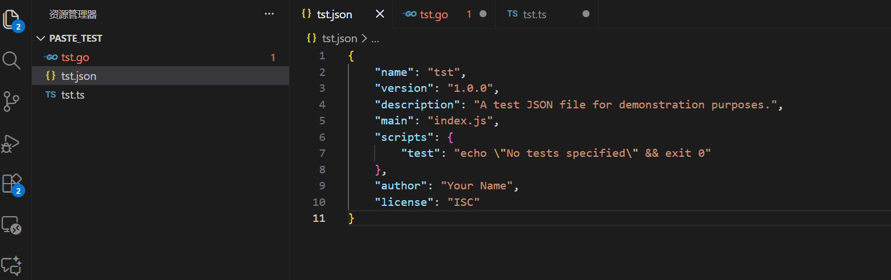

# Paste Go 

  

**Paste Go** is a smart clipboard assistant for VS Code. It automatically detects the content in your clipboard (JSON, SQL, structures or class definitions, and even natural language) and converts it into the corresponding data structure code for your current file's language.

**Paste Go** 是一个 VS Code 智能粘贴助手。它能自动检测剪贴板内容（JSON, SQL, 结构体或者类定义，甚至是自然语言），并将其转换为当前文件语言对应的结构体或类定义代码。

---

## ✨ Features / 功能特性

- ⚡ **Lightning Fast / 极速响应**:
  - Local parsing for standard formats. No internet required for basic usage.
  - 本地解析标准格式，基础功能无需联网，毫秒级响应。

- 🧠 **AI Fallback / AI 智能兜底**:
  - When local parsing fails or logic is complex, it automatically calls AI to generate the code.
  - 当本地解析失败或逻辑复杂时，自动调用 AI 生成代码。
   - Supports **DeepSeek**, **OpenAI**, **Gemini**, **Moonshot (Kimi)**, **GLM** and other OpenAI-compatible services.
   - 支持 DeepSeek、OpenAI、Gemini、Moonshot (Kimi)、GLM 等多种模型与 OpenAI 兼容服务。

- 🔌 **Multi-language Output / 多语言输出**:
   - **Outputs / 输出**: Go, TypeScript, Python, Java, Rust, C#, Kotlin, Swift, PHP, Ruby, Dart, C/C++, Scala.
   - 支持主流语言结构体/类定义代码生成。

- 📥 **Broad Input Formats / 多种输入格式**:
   - **Inputs / 输入**: JSON, SQL (CREATE TABLE), Go Struct, Python Pydantic, Natural Language.
   - 支持结构化数据与自然语言描述。

---

## 🚀 Usage / 使用方法

1. **Copy** some JSON/SQL/code/natural language to your clipboard.
   这里复制一段 JSON/SQL/代码/自然语言。
2. Open a file (e.g., `user.go` or `types.ts`).
   打开一个代码文件（如 `user.go`）。
3. Press `Ctrl + Alt + V` (Mac: `Cmd + Alt + V`).
   按下快捷键 `Ctrl + Alt + V`。
4. 🎉 The code struct is automatically inserted!
   代码结构体即刻生成！



---

## ⚙️ Configuration / 配置 AI

To enable AI superpowers using your own API Key (e.g. DeepSeek):
如需启用 AI 增强功能（例如使用 DeepSeek），请在设置中配置：

### Method 1: GUI Settings (推荐)

1. Open Settings (`Ctrl + ,`) -> Search `Paste Go`.
   打开设置 -> 搜索 `Paste Go`。
2. **API Format**: Select  `gemini` or `openai`.
   选择对应的api格式，gemini或者openai(包括deepseek, glm等)。
3. **API Key**: Enter your key (e.g., `sk-xxxx`).
   填入你的 API Key。
4. **Base URL**: (Crucial for models using OpenAI Format API) Enter the API endpoint.
   openai 接口规范的模型必填，例如 `https://api.deepseek.com`。

### Method 2: `settings.json`

1. Open `settings.json` in VS Code:
   Open Command Palette: `Ctrl + Shift + P` -> type `Open User Settings (JSON)`.
   打开设置文件：`Ctrl + Shift + P` -> 输入 `Open User Settings (JSON)`。
2. Add the config under the root object (not inside other blocks).
   Add the following under the top-level `{}`.
   在根对象中添加以下配置（不要放到其他块里）。
3. Choose provider format:
   - `openai` for OpenAI-compatible APIs (DeepSeek/GLM/Moonshot/Proxy).
   - `gemini` for Google Gemini API.
   - `openai` 适用于 OpenAI 格式接口（DeepSeek/GLM/Moonshot/自建代理）。
   - `gemini` 适用于 Google Gemini 格式接口。

```jsonc
{
    // ====== OpenAI API compatible (DeepSeek / GLM / Moonshot / Proxy) ======
    "pasteGo.aiProvider": "openai",
    "pasteGo.aiApiKey": "sk-your-api-key",
    "pasteGo.aiBaseUrl": "https://api.deepseek.com", // 必填：OpenAI 兼容模型的 BaseURL
    "pasteGo.aiModel": "deepseek-chat",              // 可选：模型名称

    // ====== Google Gemini ======
    // "pasteGo.aiProvider": "gemini",
    // "pasteGo.aiApiKey": "your-gemini-key",
    // "pasteGo.aiModel": "gemini-1.5-flash"
}
```

### Tips / 提示

- `pasteGo.aiBaseUrl` is required only for OpenAI-compatible providers (e.g. DeepSeek).
- `pasteGo.aiModel` uses a default if left empty.
- `pasteGo.aiBaseUrl` 仅在 `openai` 兼容接口时需要（如 DeepSeek）。
- `pasteGo.aiModel` 为空时会使用默认模型。


## 🤝 Contributing / 贡献

We welcome PRs! This project is built with **Go** (Core Logic) and **TypeScript** (VS Code Extension).
欢迎提交 PR！本项目由 **Go** (核心逻辑) 和 **TypeScript** (插件前端) 构建。

- **Core**: `core/` (Golang) - Parsers and Generators.
- **Extension**: `extension/` (Typescript) - UI and Process management.

---

**Enjoy Coding!** 🚀
